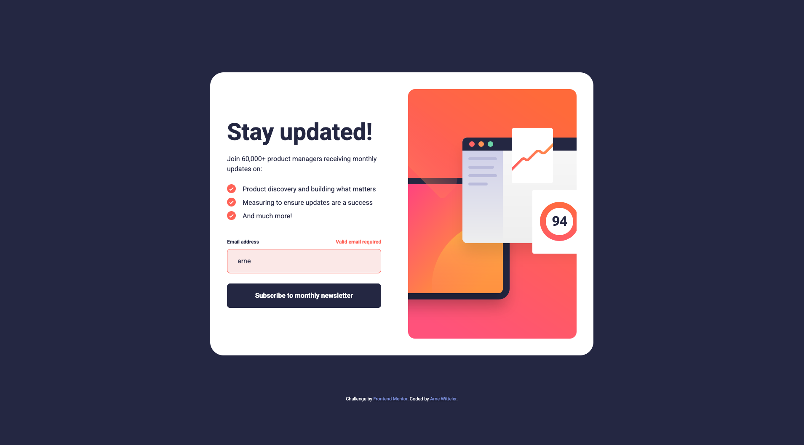

# Frontend Mentor - Newsletter sign-up form with success message solution

This is a solution to the [Newsletter sign-up form with success message challenge on Frontend Mentor](https://www.frontendmentor.io/challenges/newsletter-signup-form-with-success-message-3FC1AZbNrv). Frontend Mentor challenges help you improve your coding skills by building realistic projects. 

## Table of contents

- [Frontend Mentor - Newsletter sign-up form with success message solution](#frontend-mentor---newsletter-sign-up-form-with-success-message-solution)
  - [Table of contents](#table-of-contents)
  - [Overview](#overview)
    - [The challenge](#the-challenge)
    - [Screenshot](#screenshot)
    - [Links](#links)
  - [My process](#my-process)
    - [Built with](#built-with)
    - [Continued development](#continued-development)
    - [Useful resources](#useful-resources)
  - [Author](#author)

## Overview

### The challenge

Users should be able to:

- Add their email and submit the form
- See a success message with their email after successfully submitting the form
- See form validation messages if:
  - The field is left empty
  - The email address is not formatted correctly
- View the optimal layout for the interface depending on their device's screen size
- See hover and focus states for all interactive elements on the page

### Screenshot

### Links

- Solution URL: [Frontend Mentor solution](https://github.com/arne-witteler/newsletter-sign-up-with-success-message)
- Live Site URL: [Live demo](https://newsletter-sign-up-with-success-mes-rose.vercel.app)

## My process

### Built with

- Semantic HTML5 markup
- CSS custom properties (Variables)
- Flexbox
- Mobile-first workflow
- Vanilla JavaScript

### Continued development

In future projects, I want to focus more on accessibility (a11y), specifically ensuring that screen readers correctly announce the error messages when they appear dynamically. I also want to experiment with CSS Grid for more complex layouts.

### Useful resources

- [Regular Expressions (Regex) for Email Validation](https://stackoverflow.com/questions/46155/how-can-i-validate-an-email-address-in-javascript) - Helped me understand the pattern matching for the email input.

## Author

- Frontend Mentor - [@arne-witteler](https://www.frontendmentor.io/profile/arne-witteler)